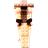
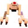
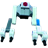
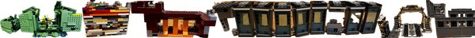
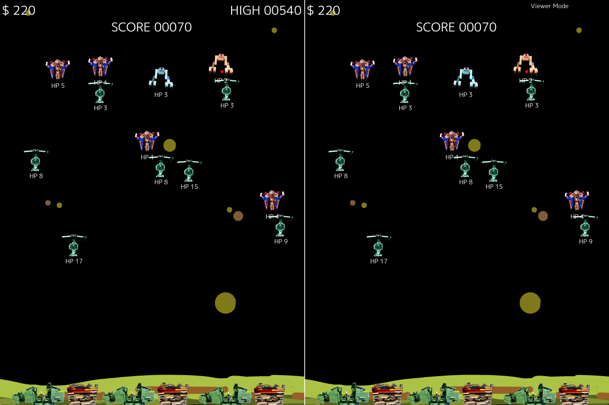

# Tower Defense

Simple tower defense game.

## Graphics assets

Graphics and sounds by Matt. Nathan created the Lego builds that were used for the assets. I took pictures of the ships and used the iPhone foreground cutting tool and some recoloration to create the spites. Then I shrunk them down to appropriate size.

### Creeps

   

### Towers

### Base

## Rules

* Towers can shoot and have health equal to their ammo.
  * When ammo or health runs out it disappears.
  * Players have a budget and can place towers with a mouse click
  * Players can select different kinds of towers with different effects (melee, ranged, AOE)
* Creeps spawn and move down the lane towards the base.
  * When a creep runs into a tower it lowers tower health by some ammount.
  * Or ranged creeps can fire from a distance
  * When a tower shoots a creep it lowers creep health
  * When creep health runs out it disappers
* Base is at end of lane and has health
* Single player to see how long you can go
  * Tracks score and level
* Multi-player
  * Against computer to see who lasts longer
  * Against another player over network

## Game Play

* In Battle
  * P or Spacebar to pause
  * R to reset game
  * Mouse left click to place a tower
  * '+' or '-' to adjust game speed
  * Q to quit
* Title screen
  * V to toggle viewer mode
* Display
  * F for full screen
  * L to display grid lines (10x10 cells)
  * D to display debug info including range indicators and targeting lines

### Title Screen

### Gameplay

### Viewer Mode

## TODOS

* ~~Pass thru debug flag to renderers~~
* ~~Collision detection for creep movement, creeps stop when running into a tower~~
  * ~~Restrict creep and tower spawn on existing objects or partially off the board~~
* ~~Make player base more resilient~~
* Creep bugs
  * Fix positioning of creeps when they run into something to make sure they're right up against it
  * ~~Fix creeps on edge of base not attacking~~
  * Don't let creeps overlap each other, stack on top
* Game screen options
  * Press some key to start
  * Choose options for game difficulty
    * Implement game difficult
  * Set other options
    * debug, range circles, etc
* Multiple tower types
  * Player selects types
  * Multi-shot
  * Blocking only
  * Bigger vs smaller
  * Upgradeable
* Levels
  * More powerful creeps
  * Money generates over time
  * Power up towers
* Base can shoot back
* Tower art
* Creep art
* ~~Multiple creep types~~
* ~~Click to place towers~~
* ~~Spawn creeps and move towards base~~
* ~~Budget for towers, or cooldowns~~
* ~~Towers attack creeps~~
  * ~~Show bullets~~
  * ~~Fix cooldown~~
* ~~Show text for health and cooldown of towers and creeps~~
* ~~Creeps attack towers~~
* ~~Add money on creep death~~
* ~~Scores~~
  * ~~save high scores~~
* Stretch
  * Computer players
  * Networking players, possibly using [text](https://github.com/leap-fish/necs)
  * Simulation for testing
  * Play simulated network opponent
  * Investigate donburi systems and events

## Remote viewer

* Make the current game update and draw into scenes
  * Start scene
  * Game scene
  * Game viewer
    * Try sending events out and have them represented in the game viewer
    * Make side by side view in single window before breaking out into separate running app
    * It could share draw logic with the main game scene but need it's own update which will just read the state off the event system
    * Once we have events populating the viewer we can add networking and everything will just work

## Network play

Things to send over network: Position, Health, Creep, Player, Tower, Bullet (and render), Game.highScore, Attack (mainly for cooldown, also debug info), Sprite renders (maybe just image name), gameover/paused status
